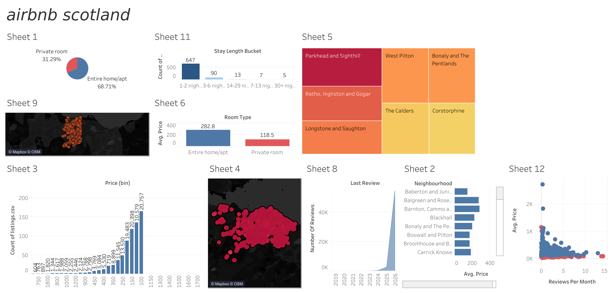

# Airbnb Scotland — Tableau Dashboard

A Tableau Public dashboard exploring Airbnb listings data for Scotland (Edinburgh), covering pricing, room types, neighbourhoods, availability, and review activity.

## 📊 Overview

This project analyzes an Airbnb listings dataset to surface patterns in pricing, accommodation type, geographic distribution, and guest engagement across Scottish neighbourhoods.

**Live dashboard:** *[Add your Tableau Public link here]*

## 🗂️ Contents

| File | Description |
|---|---|
| `mini_project_airbnb.twbx` | Packaged Tableau workbook (includes data extract) — open with Tableau or Tableau Public |
| `listings.csv` | Source Airbnb listings data |
| `README.md` | This file |

## 🧩 Dashboard Sheets

The dashboard (`Dashboard 1`) combines the following worksheets:

- **Sheet 1** — Room type split (Entire home/apt vs. Private room), pie chart
- **Sheet 2** — Average price by neighbourhood
- **Sheet 3** — Distribution of listings by price bin
- **Sheet 4** — Geographic map of listings by price/density
- **Sheet 5** — Neighbourhood treemap
- **Sheet 6 / Sheet 6 (2)** — Average price by room type
- **Sheet 7** — Additional listing breakdown
- **Sheet 8** — Number of reviews over time (by last review date)
- **Sheet 9** — Map of listing locations
- **Sheet 11** — Stay length bucket distribution (nights booked)
- **Sheet 12** — Reviews per month vs. average price (scatter)

## 📁 Data Fields

Key columns used from the listings dataset:

`Id`, `Name`, `Host Id`, `Host Name`, `Neighbourhood Group`, `Neighbourhood`, `Latitude`, `Longitude`, `Room Type`, `Price`, `Minimum Nights`, `Number Of Reviews`, `Last Review`, `Reviews Per Month`, `Calculated Host Listings Count`, `Availability 365`, `License`, `Number Of Reviews Ltm`

## 🛠️ Tools Used

- **Tableau Public** — data visualization and dashboard design
- **CSV** — raw listings data source

## 🚀 How to Open

1. Download [Tableau Public](https://public.tableau.com/en-us/s/download) (free) or use Tableau Desktop.
2. Open `mini_project_airbnb.twbx` — it's a packaged workbook, so the data is bundled in and no extra setup is needed.

## 📌 Notes

- `.twbx` is a zipped/packaged format (workbook + data extract), so it can be a large binary file in git — consider [Git LFS](https://git-lfs.com/) if it exceeds GitHub's file size limits.
- If you'd rather version the workbook as readable XML, you can instead save/export a `.twb` file (references the CSV externally) alongside `listings.csv`.

## 📄 License

*[Add your preferred license, e.g. MIT]*